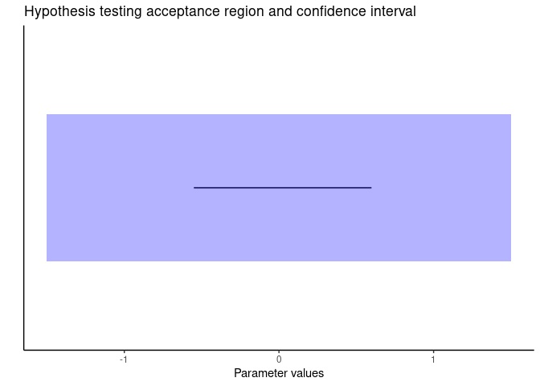
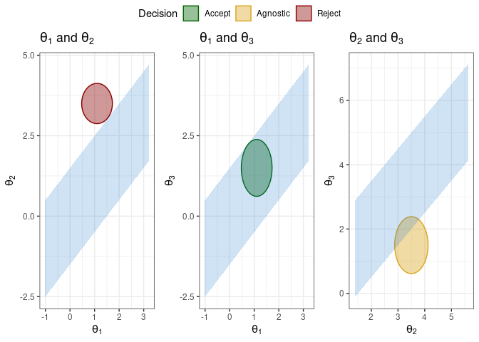

<!-- README.md is generated from README.Rmd. Please edit that file -->

# REACT: Region of Equivalence Agnostic Confidence-based Test

<!-- badges: start -->
<!-- badges: end -->

The goal of REACT is to perform equivalence three-way hypothesis testing
in a user-friendly manner. In its simplest form REACT consists in:

<!-- enrich this steps more later -->

1.  **Establishing the region of equivalence.**
2.  **Build a Confidence Set.**
3.  **Test null hypothesis using a confidence set following a three-way
    rule.**

<!-- Continue writing more later -->

We can have three kinds of conclusions: accept, reject or remain
agnostic.

## Installation

You can install the development version of REACT from
[GitHub](https://github.com/Monoxido45/REACT) with:

``` r
# install.packages("devtools")
devtools::install_github("Monoxido45/REACT")
```

## Base test example

Any REACT simple hypothesis testing can be conducted just by providing a
confidence interval, a chosen tolerance and the original simple
hypothesis in the *base_test* function:

``` r
library(REACT)
## REACT t-test

set.seed(125)
obs1 <- rnorm(n = 30, mean = 1)
obs2 <- rnorm(n = 30, mean = 1.1)

# building confidence set
ci <- t.test(obs1, obs2, var.equal=TRUE, conf.level = 0.95)$conf.int
# tolerance
tol <- 1.5

# performing base test and getting the output
test <- base_test(ci, tol = 1.5, hyp = 0, verbose = TRUE)
#> REACT results:
#> Pragmatic lower bound:  -1.50
#> Pragmatic upper bound:  1.50
#> Confidence interval:
#> lower bound: -0.55
#> upper bound: 0.598
#> REACT conclusion:
#> Based on the provided confidence interval we accept the null hypothesis.
```

We can also plot the CI compared to the region of equivalence:

``` r
plot(test)
```



## Multiple comparisons example

One can also perform multiple comparisons of several parameters while
maintaining logical coherence by using *m_comparisons*:

``` r
# vector of point estimations
par <- c(1.1, 3.5, 1.5)

# fisher matrix
var_cov <- diag(c(0.05, 0.05, 0.1), nrow = 3, ncol = 3)

# tolerance
tol <- 1.5

REACT::m_comparisons(alpha = 0.05, nrow = 1, ncol = 3,
                     tol = tol, par = par, f_matrix = var_cov)
```


